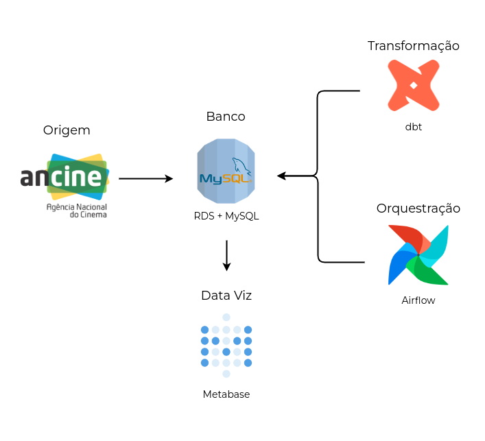

# ancine-database

PUC Minas Projeto 4 - Desenvolvimento de um Projeto de Big Data Analytics - 2024/01  

Projeto original utilizando AWS - ambiente produtivo, portanto com um custo monetário atrelado ao seu desenvolvimento.  
Para um desenvolvimento sem custo se vê necessário a troca de hospedagem do banco PostgreSQL e do orquestrador Airflow, respectivamente originariamente hospedados no RDS e EC2 (AWS).

### Arquitetura

## Projeto

### Infraestrutura

Para construção e funcionamento do projeto primeiro precisamos criar e configurar sua infraestrutura, por padrão o projeto está utilizando produtos da AWS, como EC2 e RDS.   
Para sua construção foi escolhido o uso do framework open-source Terraform, por ser um IaC (Infrastructure as Code), possibilitando o desenvolvimento e manuseio da Infraestrutura por meio de código, facilitando a replicabilidade e manutenção.

Para o desenvolvimento da infraestrutura:

1. [EC2](https://github.com/matbragan/ancine-database/tree/main/terraform/ec2)
2. [RDS](https://github.com/matbragan/ancine-database/tree/main/terraform/rds)
3. [GitHub Action](https://github.com/matbragan/ancine-database/tree/main/.github/workflows)

### Origem

A origem dos dados estão na página do governo, onde mensalmente a Ancine faz o carregamento dos conjuntos de dados relevantes para o projeto.   
Dados disponibilizados em: https://dados.gov.br/dados/organizacoes/visualizar/agencia-nacional-do-cinema

### Banco

O SGBD escolhido para o projeto foi o PostgreSQL, por se tratar de um banco com alta performance de query e simplicidade em seu manuseio.   
Por meio de scripts em Python é feito o download das bases de dados em sua origem e transformados em tabelas para o PostgreSQL - utilizando SQLAlchemy.   
Tais scripts podem ser encontrados dentro do repositório [aqui](https://github.com/matbragan/ancine-database/tree/main/airflow/plugins).   
> ⚠️ **IMPORTANTE**  
> Se atente em popular um arquivo chamado `.env` utilizando o `.env_template` como auxiliar. Esse arquivo será importante para a criação das tabelas origens no PostreSQL e para a transformação dos dados utilizando o dbt.

### Transformação

Após os dados em seu formato original (conjuntos de dados da Ancine) serem carregados para o PostgreSQL é feito transformações neles afim de termos melhores dados tratados e trabalhados para fins análiticos.   
Para tais transformações foi escolhido o framework open-source dbt, por possibilitar que engenheiros de dados criem modelos de forma intuitiva e declarativa, facilitando a definição de estruturas de dados complexas e transformações específicas com uma sintaxe familiar.   
As configurações e seus modelos (tabelas) do dbt podem ser encontrados dentro do repositório [aqui](https://github.com/matbragan/ancine-database/tree/main/dbt/ancine).

### Orquestração

Tendo os scripts em Python de download e carregamento das tabelas e os modelos no dbt de transformação, se ve necessário uma orquestração, possibilitando todo carregamento e atualização dos dados ponta a ponta de forma automática e sistemática.   
Para orquestração foi utilizado Airflow e sua construção pode ser encontrada dentro do repositório [aqui](https://github.com/matbragan/ancine-database/tree/main/airflow).