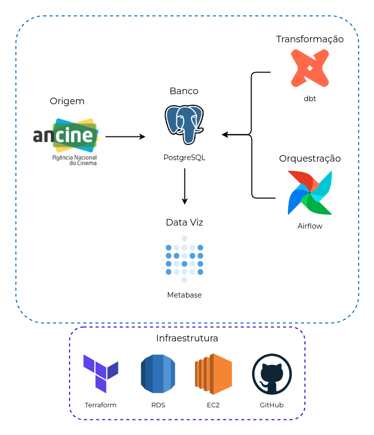

# ancine-database
PUC Minas Projeto 4 - Desenvolvimento de um Projeto de Big Data Analytics - 2024/01  

Projeto original utilizando AWS, portanto com um custo monetário ao seu desenvolvimento.  
Para um desenvolvimento sem custo se vê necessário a troca de hospedagem do banco PostgreSQL e do orquestrador Airflow, respectivamente originariamente hospedados no RDS e EC2 (AWS).

### Arquitetura
